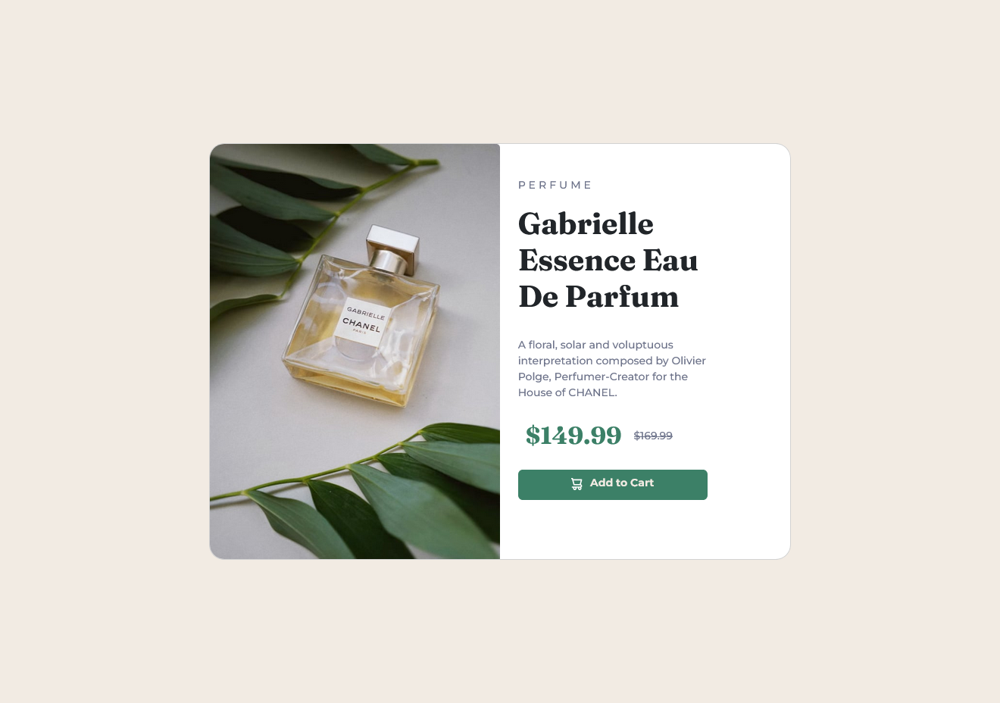
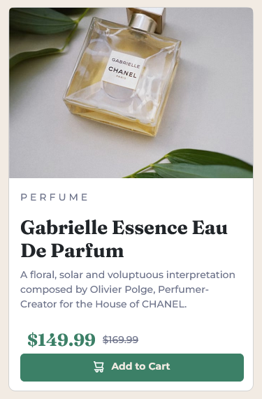

# Frontend Mentor - Product preview card component solution

This is a solution to the [Product preview card component challenge on Frontend Mentor](https://www.frontendmentor.io/challenges/product-preview-card-component-GO7UmttRfa). Frontend Mentor challenges help you improve your coding skills by building realistic projects. 

## Table of contents

- [Overview](#overview)
  - [The challenge](#the-challenge)
  - [Screenshot](#screenshot)
  - [Links](#links)
- [My process](#my-process)
  - [Built with](#built-with)
  - [What I learned](#what-i-learned)
  - [Continued development](#continued-development)
- [Author](#author)


## Overview

### The challenge

Users should be able to:

- View the optimal layout depending on their device's screen size
- See hover and focus states for interactive elements

### Screenshot


It is view of desktop (1440px).



It is view od mobile (375px).


### Links

- Solution URL: [solution URL here](https://github.com/katrine9176/Card-preview-Frontendmentor)
- Live Site URL: [live site URL here](https://katrine9176.github.io/Card-preview-Frontendmentor/)

## My process

1. I made basic HTML and CSS structure.
2. Added framework Bootsrapt which help me built a card.
3. Make mobile version (375px).
4. Make desktop version (1440px).
5. Added div .attribution.

That's all.

### Built with
- Bootstrap,
- Flexbox.

### What I learned

Some html code I'm pround of:
```html
      
      
```

If you want more help with writing markdown, we'd recommend checking out [The Markdown Guide](https://www.markdownguide.org/) to learn more.


### Continued development

I want to learn advanced CSS and basic JS actually. 


## Author

- Frontend Mentor - [@katrine9176](https://www.frontendmentor.io/profile/katrine9176)


